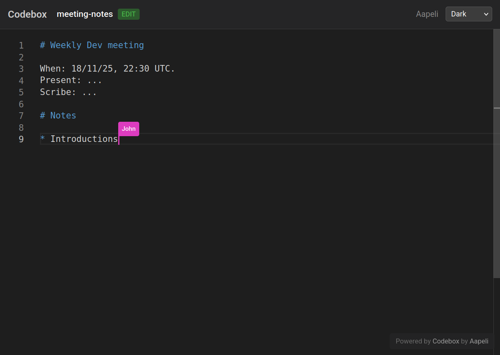

# Codebox

**Note:** this repo was built by and large with Claude, and builds off of the [Yjs Demos](https://github.com/yjs/yjs-demos) Monaco demo (public domain).

## Features

* Real-time collaborative editing (Monaco + Yjs)
* Live cursors with usernames
* Syntax highlighting
* Dark/light themes
* Password protection options:
  - Unprotected (anyone can edit/view)
  - Edit protected (anyone can view but edit requires password)
  - Fully protected (both view/edit required password)
  - View only (no one can edit)
* Admin dashboard
* Pre-built Docker container

## Note on security

Don't use this for super secret stuff. Security caveats:

* Admin password is securely hashed with bcrypt
* Notepad passwords are **stored in plain text** (so admin can see them) and use naive compare
* When a user enters a notepad, they get a JWT token for 24 hours: if you change the protection level, their access is not automatically revoked
